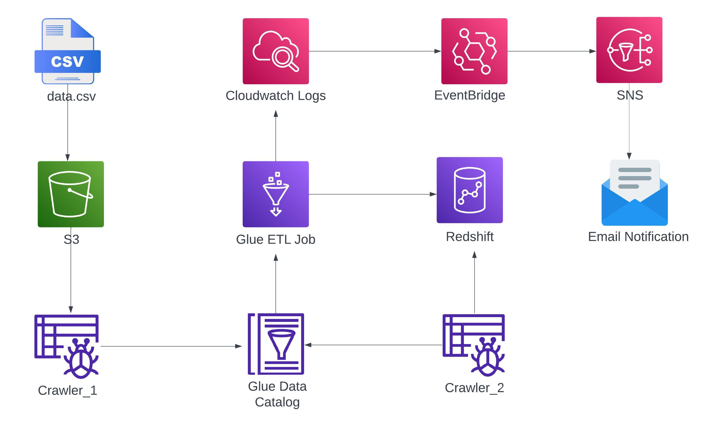

## **🎬 Quality Movies Data Ingestion – AWS Batch Processing Pipeline**  

### **🚀 Project Overview**  
This project implements an **automated data ingestion pipeline** for movie datasets, ensuring **only high-quality movies (IMDb rating ≥ 8.5)** are stored in **Amazon Redshift**. Any **low-rated movies (< 8.5 IMDb)** are flagged as bad data, logged in **CloudWatch**, and trigger an **email alert via SNS**.  

---

## **📌 Architecture & Workflow**  
### **🛠️ Services Used:**  
✅ **Amazon S3** – Stores raw movie data.  
✅ **AWS Glue Crawler** – Scans & catalogs data from S3.  
✅ **AWS Glue Job** – Performs **ETL & data quality checks**.  
✅ **Amazon Redshift** – Stores **only high-rated movies (IMDb ≥ 8.5)** via **JDBC**.  
✅ **Amazon CloudWatch Logs** – Captures bad data logs.  
✅ **Amazon EventBridge** – Detects bad data logs & triggers alerts.  
✅ **Amazon SNS** – Sends **email notifications** when bad data is detected.  

---

## **📊 How It Works**
1️⃣ **Raw Data Storage**: Movie data is stored in **S3**.  
2️⃣ **Metadata Extraction**: **AWS Glue Crawler** scans & catalogs the data.  
3️⃣ **ETL & Data Quality Validation**:  
   - AWS Glue job runs **transformations & quality checks**.  
   - ✅ **Valid Data (IMDb 8.5 - 10)** → Ingested into **Amazon Redshift** via **JDBC**.  
   - ❌ **Bad Data (IMDb < 8.5)** → Logged in **CloudWatch Logs**.  
4️⃣ **Alert System for Bad Data**:  
   - **EventBridge rule** detects bad data logs.  
   - **SNS notification** is sent via email.  

---

## **📜 AWS Glue Job – Data Quality Checks**  
🔍 **Validation Rules Applied:**  
✔️ **Null Checks** – Ensures required fields (e.g., movie title, release year) are present.  
✔️ **Data Type Validation** – Verifies correct data formats (e.g., year as integer).  
✔️ **Range Checks** – IMDb rating must be between **8.5 and 10**.  
✔️ **Duplicate Handling** – Removes duplicate movie entries.  

> ❌ **Any movie with IMDb < 8.5 is considered "bad data"** and is **not loaded into Redshift**. Instead, it is logged in **CloudWatch**, and an alert is triggered via **EventBridge + SNS**.  

---

## **📧 Handling Bad Data with EventBridge & SNS**
- If **IMDb < 8.5**, the movie entry is rejected, and an error log is stored in **CloudWatch**.  
- **EventBridge rule** monitors logs and triggers an **SNS email notification**.  
- The team gets an **email alert** to review the flagged data.  

📌 *Example SNS Alert Email:*  
> "Alert: A movie with IMDb rating below 8.5 has been detected and excluded from the dataset. Please review CloudWatch logs for details."  

---

## **📸 Screenshots & Architecture Diagram**
📌 *Architecture Diagram:*  
  

---

## **🔗 How to Run the Project**
### **1️⃣ Prerequisites**
- AWS account with access to **S3, Glue, Redshift, EventBridge, and SNS**.  
- Data stored in **Amazon S3** in CSV/Parquet format.  

### **2️⃣ Steps to Deploy**
1. **Upload movie dataset** to **S3**.  
2. **Run AWS Glue Crawler** to catalog data.  
3. **Trigger AWS Glue ETL job** to transform & validate data.  
4. **Verify high-rated movies (IMDb ≥ 8.5) in Redshift**.  
5. **Check SNS email alerts for movies with IMDb < 8.5**.  

---

## **📌 Key Takeaways**
✔️ Automated **batch processing & ETL** pipeline using AWS Glue.  
✔️ **IMDb rating-based data quality validation**.  
✔️ **Alerting mechanism for bad data using EventBridge & SNS**.  
✔️ **Scalable & cost-efficient AWS cloud architecture**.  

---  
